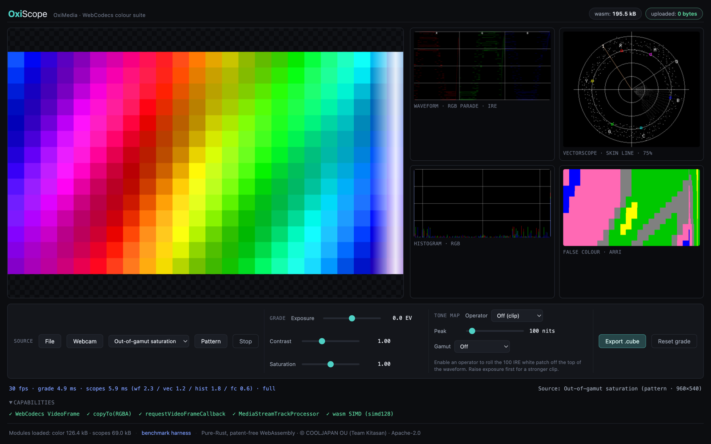
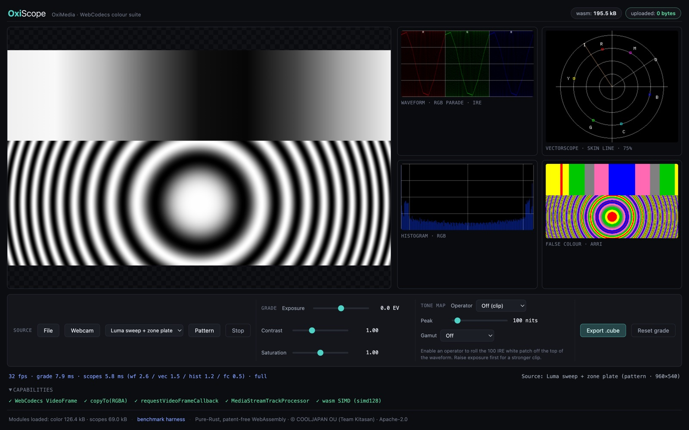

# oximedia-web

> WebCodecs gives you the frames. OxiMedia gives you what to do with them.

`@cooljapan/oximedia-web` is a set of small, independent WebAssembly modules
that sit downstream of the browser's own [WebCodecs](https://developer.mozilla.org/en-US/docs/Web/API/WebCodecs_API)
decoder. WebCodecs hands you `VideoFrame`s; these modules turn those frames
into waveform/vectorscope/histogram scopes, colour grading and tone-mapping,
high-quality resampling, and PSNR/SSIM quality metrics — all in Pure Rust,
compiled to `wasm32-unknown-unknown`, with no native dependencies and no
server round-trip.

[](https://cooljapan.tech/oxiscope/)

**[OxiScope](demo/)** — the bundled colorist demo, with all four scopes
reading the out-of-gamut saturation pattern at 30 fps.
**[Try it live](https://cooljapan.tech/oxiscope/)** or run
[`scripts/serve.sh`](scripts/serve.sh) locally; the badge in the header
counts the bytes uploaded: 0, because nothing ever leaves the page.

This is a nested Cargo workspace inside the OxiMedia monorepo
(`/web`, excluded from the root workspace) and a separate, independently
versioned npm package — `package.json` is filled in and `dist/` builds
cleanly, but **it has not been published to npm yet** (see
[Quick start](#quick-start) for how to use it locally today). It does not
depend on the native `oximedia-*` crates; see [Implementation
strategy](#implementation-strategy) below for why.

## Patents

OxiMedia implements zero patent-encumbered codecs — not one line. H.264/H.265/AAC
decode and encode are performed by the browser, whose vendor already holds
the licence — exactly as `<video>` has always worked. Everything OxiMedia
contributes (colour, scopes, scaling, metrics) is either unpatented
mathematics or covered by royalty-free specifications.

We make no blanket "patent-free" guarantee over formats we do not control
(AV1/VP9/Opus royalty-free status is asserted by their standards bodies and
disputed by third-party pools such as Sisvel); we implement no
patent-encumbered codec and we delegate codec work to the browser — that
claim is airtight.

## Modules

Each module is an independent wasm binary with its own `package.json`
export, so a page that only needs a waveform monitor doesn't pay for the
color-management pipeline.

| module    | crate                    | purpose                                                | wasm gzip (soft / hard) | wasm measured | glue gzip (soft / hard) | glue measured |
|-----------|---------------------------|--------------------------------------------------------|--------------------------|----------------|--------------------------|----------------|
| `scopes`  | `oximedia-web-scopes`    | waveform, vectorscope, histogram, false-colour          | 150 kB / 200 kB          | 26,978 B (18% of soft) | 15 kB / 25 kB | 7,615 B |
| `color`   | `oximedia-web-color`     | exposure/contrast/saturation, tone-mapping, gamut, LUT  | 200 kB / 250 kB          | 59,636 B (29% of soft) | 15 kB / 25 kB | 9,504 B |
| `scale`   | `oximedia-web-scale`     | Lanczos / Catmull-Rom / Mitchell / bilinear resampling  | 120 kB / 160 kB          | 18,464 B (15% of soft) | 15 kB / 25 kB | 7,961 B |
| `quality` | `oximedia-web-quality`   | PSNR / SSIM metrics                                     | 200 kB / 250 kB          | 13,705 B (7% of soft)  | 15 kB / 25 kB | 6,209 B |

"wasm measured" is the `*_bg.wasm` alone; "glue measured" is the
wasm-bindgen JS glue plus the hand-written `js/*.js` wrapper, combined.
Combined total for all four modules + glue: 512,000 B / 614,400 B
(soft/hard) budget, **150,072 B measured** (29% of the soft budget). This
table grew from a prior 144,045 B snapshot because a kernel perf-retune
pass (see [Measured performance](#measured-performance) below and the
[`CHANGELOG`](../CHANGELOG.md) `[Unreleased]` entry) traded a modest size
increase (const-span monomorphised resampling taps, u64-packed LUT lattice
points, 4-banked histograms) for real speedups — still comfortably inside
budget. Every number in this table was produced by running
[`scripts/build.sh`](scripts/build.sh) followed by
[`scripts/size-gate.sh`](scripts/size-gate.sh) against a fresh
`--release` build (gzip -9) — re-run those two scripts yourself to
reproduce or refresh them; nothing here is hand-typed. See that script for
the exact byte thresholds per module.



The `scopes` module reading the demo's luma-sweep + zone-plate pattern:
the R/G/B waveform parade traces the sweep at full height, while the
vectorscope stays near-empty — correctly, because a greyscale source has
no chroma to plot.

## Guarantees

- **No COOP/COEP required.** Nothing in this package touches
  `SharedArrayBuffer` or `Atomics.wait`, so it never needs
  `Cross-Origin-Opener-Policy` / `Cross-Origin-Embedder-Policy` headers.
  Every module runs on plain single-threaded wasm — drop it into any static
  host, including one you don't control the response headers for.
- **`#![forbid(unsafe_code)]` everywhere.** Every crate in `web/crates/*`
  forbids `unsafe` at the crate root — no exceptions, no `unsafe` blocks
  hidden behind a feature flag.
- **No `f64` across the wasm boundary, no per-frame JSON.** Frame-rate
  paths use typed `f32`/`u8` getters, not JSON serialization.

## Browser support

- **Tested so far: headless Chrome (Chromium ~150) on macOS only.** The demo
  ([`demo/`](demo/)) and benchmark harness ([`bench/`](bench/)) have both
  been exercised end-to-end against headless Chrome via
  [`bench/run.sh`](bench/run.sh) and manual verification; nothing here has
  been run against Firefox, Safari, or a non-macOS host yet. The modules
  themselves target only standard `wasm32-unknown-unknown` + WebCodecs +
  Canvas2D/OffscreenCanvas APIs (no Chrome-only intrinsics), so other
  evergreen browsers with WebCodecs support are expected to work, but that
  expectation is untested, not verified.
- **`VideoFrame.copyTo()` format support varies by browser/decoder.** The
  shared frame helper ([`js/_frame.js`](js/_frame.js)) requests RGBA output
  from `copyTo` and falls back to drawing the frame onto an
  `OffscreenCanvas` and reading it back with `getImageData` when the direct
  copy path isn't available or doesn't produce RGBA — this fallback is real
  and load-bearing, not aspirational, but it is measurably slower (see
  [`bench/README.md`](bench/README.md)'s note on frame-acquisition cost
  being included in the numbers).
- **Capability detection is built in.** `detectCapabilities()` (exported
  from [`js/_frame.js`](js/_frame.js), re-exported by every module's
  wrapper) reports `videoFrame`, `copyToRgba`, `rvfc`
  (`requestVideoFrameCallback`), `trackProcessor`
  (`MediaStreamTrackProcessor`), and `simd` (whether the wasm `simd128`
  feature validates in the current engine) so a caller can branch on real
  capability rather than user-agent sniffing. The demo's diagnostics panel
  uses exactly this API; there is no software fallback for a missing `simd`
  capability — wasm compiled with `-C target-feature=+simd128` simply won't
  validate.

## Limitations

- **Vectorscope chroma math is BT.601, matching upstream.** The vectorscope
  (and the other chroma-plotting scope math in `oximedia-web-scopes`) uses
  `oximedia-web-core`'s BT.601 fixed-point Y'CbCr kernel — bit-exact with
  the native `oximedia-scopes` crate it was ported from, IRE/graticule
  quirks included. Luma, histogram, false-colour, and stats readouts use
  BT.709 instead. This split is inherited from upstream, not a bug
  introduced during the port.
- **Two different things are both called "ACES" in `oximedia-web-color`,
  and neither is the Academy reference transform.** `'aces'` is the
  Narkowicz-2015 *fitted* filmic curve (the common real-time
  approximation); `'aces-odt'` is `AcesOt2`, an OxiMedia port shaped after
  the ACES Output-Transform-2.0 RRT/ODT (per-channel S-curve + peak-nits
  shoulder + parametric gamut compression) — not a bit-exact CTL
  implementation. See the `ToneMapOperator` doc comment in
  [`js/color.d.ts`](js/color.d.ts) for the exact wording.
- **`oximedia-web-quality`'s SSIM is single-scale, not MS-SSIM.** It's a
  real windowed (11×11 Gaussian, σ=1.5) SSIM matching the constants and
  window/edge handling of `oximedia-quality`'s `ssim.rs`, cross-validated
  against a naive direct-window reference — but it is one scale, not the
  multi-scale MS-SSIM some tools default to, and VMAF is not implemented at
  all (see [`js/quality.d.ts`](js/quality.d.ts)).
- **`oximedia-web-color`'s and `oximedia-web-scale`'s WASM performance
  targets are not yet met**, despite a kernel perf-retune pass that made
  both substantially faster (see
  [Measured performance](#measured-performance) below for the exact
  numbers and what changed). `color`'s exposure+ACES+LUT33 chain measures
  ~25 ms/1080p-frame against a ≤12 ms target (~3.7x faster than the
  pre-retune baseline, still not met); `scale`'s Lanczos3 4K→1080p
  downscale measures ~52 ms against a ≤40 ms target (~5.4x faster, still
  not met). Both gaps are attributed to `VideoFrame` acquisition/copy cost
  around the wasm kernel rather than the kernel itself — see
  [Measured performance](#measured-performance) for the reasoning — but
  that attribution is not independently re-verified in this pass; re-run
  [`bench/`](bench/) for current numbers on your own machine rather than
  trusting either figure blindly.

## Quick start

```sh
web/scripts/serve.sh        # serves web/ at http://localhost:8080 (no headers needed)
# open http://localhost:8080/demo/
```

Or, after building (`web/scripts/build.sh`), import a module directly from
`dist/` in your own page (this package is not on npm yet — see
[Implementation strategy](#implementation-strategy) below and the root
[`README.md`](../README.md#oximedia-web-browser-modules) for the publish
status):

```js
import { Scopes } from './dist/scopes.js';

const scopes = await Scopes.create({ width: 512, height: 256 });
await scopes.waveform(videoFrame, canvas, { mode: 'rgb-parade' });
```

Every module's real, currently-shipping API surface is documented as
TypeScript declarations in [`js/*.d.ts`](js/) — `scopes.d.ts`, `color.d.ts`,
`scale.d.ts`, `quality.d.ts`, `_frame.d.ts` — those files are the source of
truth for method signatures and options, not this README.

## Benchmarks

[`bench/`](bench/) is the only source of performance numbers for this
package — every timing figure this project publishes (including the
[Measured performance](#measured-performance) section below and the
"performance targets are not yet met" note above) comes from running
[`bench/run.sh`](bench/run.sh) against the real `dist/*.js` wrappers. **No
benchmark results are committed anywhere in this repository yet**
([`bench/results/README.md`](bench/results/README.md) explains why and how
that could change); run the harness yourself (`./web/bench/run.sh`) to get
numbers for your own machine and browser.

## Measured performance

The table below is the median of **two consecutive local `./web/bench/run.sh`
runs**, immediately after a full `./web/scripts/build.sh` clean rebuild
(each run: 10 untimed warmup calls + 60 timed calls per suite; the two runs'
medians agreed within ~2.1% of each other for every suite, well inside the
~15% tolerance this project requires before trusting a number — see
[`bench/README.md`](bench/README.md) for the full methodology). Nothing
here is hand-typed; both raw runs came straight out of
[`bench/run.sh`](bench/run.sh)'s own table output, and the second run's
full JSON (env + p95/min per suite) is what's currently sitting in
[`bench/results/local-latest.json`](bench/results/local-latest.json).

**Environment:** `HeadlessChrome/150.0.0.0` (Google Chrome 150, headless),
`navigator.hardwareConcurrency` = 8, macOS, measured 2026-07-12. The
machine was not running any other build/benchmark agent at the time, but
was not fully idle either — background load average was ~6-7 on this
8-core machine (the user's normal desktop Chrome session, editors, etc.)
both before and during the runs; see `env.timestamp` /
`env.hardwareConcurrency` in `local-latest.json` for the raw capture.

| suite | run 1 median | run 2 median | budget | status |
|---|---|---|---|---|
| `scopes`: waveform (1080p) | 6.10 ms | 6.00 ms | — | — |
| `scopes`: vectorscope (1080p) | 4.20 ms | 4.20 ms | — | — |
| `scopes`: histogram (1080p) | 2.45 ms | 2.40 ms | — | — |
| `scopes`: falseColor (1080p) | 0.20 ms | 0.20 ms | — | — |
| `scopes`: all-four combined (1080p) | 13.00 ms | 13.25 ms | ≤16 ms target / ≤8 ms stretch | **target met**; stretch not met |
| `scopes`: all-four combined (1080p, worst-case noise) | 13.60 ms | 13.40 ms | (informational only) | — |
| `color`: exposure+aces+lut33 (1080p) | 25.10 ms | 24.90 ms | ≤12 ms target | **not met** (~3.7x faster than this pass's pre-retune baseline) |
| `scale`: lanczos3 (4K → 1080p) | 51.80 ms | 52.25 ms | ≤40 ms target | **not met** (~5.4x faster than this pass's pre-retune baseline) |
| `quality`: ssim+psnr (1080p pair) | 32.15 ms | 32.50 ms | (no budget defined) | — |
| `baseline-js`: luma waveform (1080p) | 5.50 ms | 5.40 ms | — | — |
| `baseline-js`: luma histogram (1080p) | 3.10 ms | 3.10 ms | — | — |
| `baseline-canvas2d`: downscale drawImage+getImageData (4K → 1080p) | 6.50 ms | 6.60 ms | — | — |

**Honest framing, stated plainly:** the `scopes` all-four-combined budget
(≤16 ms) is **met** on this machine (the ≤8 ms stretch goal is not, and
worst-case-noise input costs slightly more at 13.4–13.6 ms). The `color`
(≤12 ms) and `scale` (≤40 ms) budgets are **not met**, even though both
kernels got substantially faster this pass — both suites measure the full
wrapper call, which includes real `VideoFrame`/canvas acquisition cost on
top of the wasm kernel itself (see
[`bench/README.md`](bench/README.md#limitations)'s "frame acquisition is
part of what's measured, on purpose" note); this project's position is
that a real integrator pays that cost too, so it is reported rather than
subtracted out. Re-run [`bench/run.sh`](bench/run.sh) yourself — on this
machine, in this browser, on this day — before trusting any of these
numbers on a different machine, browser, or load condition; see
[`bench/README.md`](bench/README.md)'s own Limitations section for why a
single machine/single browser/single day snapshot should never be treated
as a durable performance claim.

## Dev guide

```sh
web/scripts/build.sh                 # wasm-pack build all four modules -> web/dist/
web/scripts/build.sh scopes color    # build a subset

web/scripts/size-gate.sh             # enforce gzip size budgets against web/dist/
web/scripts/dep-gate.sh              # enforce the wasm32 dependency allowlist

cargo check  --manifest-path web/Cargo.toml --workspace
cargo check  --manifest-path web/Cargo.toml --workspace --target wasm32-unknown-unknown
cargo clippy --manifest-path web/Cargo.toml --workspace -- -D warnings
cargo clippy --manifest-path web/Cargo.toml --workspace --target wasm32-unknown-unknown -- -D warnings
cargo deny   --manifest-path web/Cargo.toml check licenses
```

Adding a new transitive dependency to the wasm32 dep tree requires a
size-justified edit to [`allowed-deps.txt`](allowed-deps.txt); `dep-gate.sh`
fails the build otherwise, and a short list of crates (`tokio`, `rayon`,
`reqwest`, `sqlx`, `serde_json`, `serde`, `rand`, `getrandom`, and any
non-`oximedia-web-*` `oximedia-*` crate) is hard-forbidden regardless of
that file.

## Implementation strategy

The M1/M3/M5 milestones **port** algorithms from the native `oximedia-*`
analysis crates (`oximedia-scopes`, `oximedia-hdr`, `oximedia-colormgmt`,
`oximedia-lut`, `oximedia-scaling`, `oximedia-quality`) into
`oximedia-web-core` as dependency-free `f32`/`u8` kernels, rather than
depending on those crates directly. The native crates carry `rayon`,
`scirs2` (BLAS-backed), `serde_json` and `f64` data planes that would blow
both the size gate and the wasm32 dependency allowlist. See each web
crate's `lib.rs` doc comment for its canonical-source file list.

## Non-goals

- No demuxers or muxers — WebCodecs (via `MediaSource`/`EncodedVideoChunk`)
  already owns container demux; this package starts from decoded frames.
- No codecs, patent-encumbered or otherwise — decode/encode stays with the
  browser's native `VideoDecoder`/`VideoEncoder`.
- No threads, no `SharedArrayBuffer`, no `Atomics` — see
  [Guarantees](#guarantees).
- No ffmpeg filter-graph strings or filter DSL — every transform is a typed
  function call, not a string to parse.

## Roadmap

See [`TODO.md`](TODO.md).
